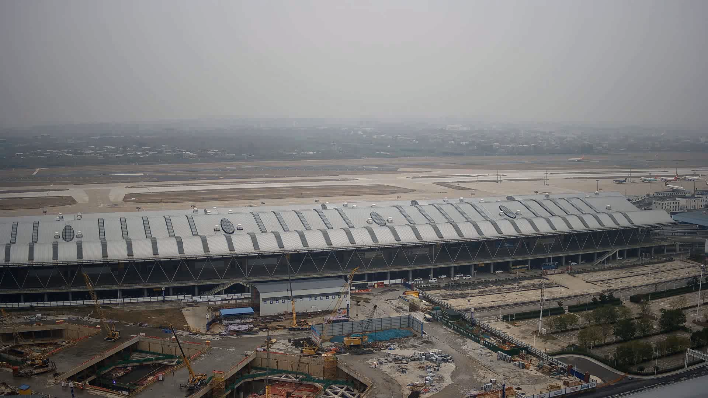

## 0x00 Intro

> This project is a simple implementation of opencv for the following papers.
>
> Du, Chengyao, et al. (2020). GPU based parallel optimization for real time panoramic video stitching. Pattern
> Recognition Letters, 133, 62-69.

Fast panorama stitching method using UMat.

Speed of 4 cameras at 4k resolution is greater than 200fps in 1080ti.

This project does not provide a dataset so it cannot be used out of the box.

一个使用 OpenCV 进行快速全景视频拼接的方法。通过巧妙的流并行策略，在 1080ti 上可以对 4k 视频进行超过 200fps 的图像拼接。

## 0x01 Quick Start

```
$ mkdir build && cd build
$ cmake ..
$ make
$ ./image-stitching
```

## 0x02 Example

> About these procedure below (chinese) http://s1nh.com/post/image-stitching-post-process/ .

| 00.mp4                    | 01.mp4                    | 02.mp4                    | 03.mp4                    |
|---------------------------|---------------------------|---------------------------|---------------------------|
|  |  |  |  |

stitching  


exposure-mask  


exposure-mask-refine  


apply-mask


final-panorama


# 记录
## 库版本要求
opencv>=4.5
## 仓库相关
仓库地址
cd /userdata/Projects/yzy/gpu-based-image-stitching-dataset-new/gpu-based-image-stitching/
opencv4.9地址
cd /userdata/Projects/yzy/opencv/opencv-4.9.0/build

## 打开虚拟环境流程
cd /userdata/Projects
激活环境：source rknn-env/bin/activate
cd /userdata/Projects/rknn-toolkit2/rknn-toolkit-lite2/examples/Detect2/code/UI。
然后输入./run_ui.sh或python main.py运行。

# 仓库远程操作命令
## 克隆仓库
git clone <仓库URL>
## 查看本地仓库状态
git status
## 添加所有变更到暂存区
git add .
##  提交到本地仓库
git commit -m "提交说明"
##  推送到远程仓库
git push
### 首次推送并建立追踪关系
git push -u origin <本地分支名>
## 拉取远程更新
git pull
## 从dataset分支拉取仓库
git pull origin dataset
## 查看分支
本地分支：git branch
远程分支：git branch -r
所有分支（本地+远程）：git branch -a
## 新建分支
仅创建分支（不切换）：git branch <新分支名>
创建并切换到新分支：git checkout -b <新分支名> 或 git switch -c <新分支名>
## 切换分支
git checkout <分支名> 或 git switch <分支名>
## 撤销与回退
撤销工作区的修改（未暂存）：git checkout -- <文件>
撤销暂存区的文件（回到工作区）：git reset HEAD <文件>
回退到上一个提交（保留工作区修改）：git reset --soft HEAD^
彻底回退到某个提交（丢弃之后的所有修改）：git reset --hard <commit-id>
## 解决冲突
当 git pull 或 git merge 产生冲突时，需要手动编辑冲突文件，解决后执行：
git add <已解决的文件>
git commit -m "解决冲突"